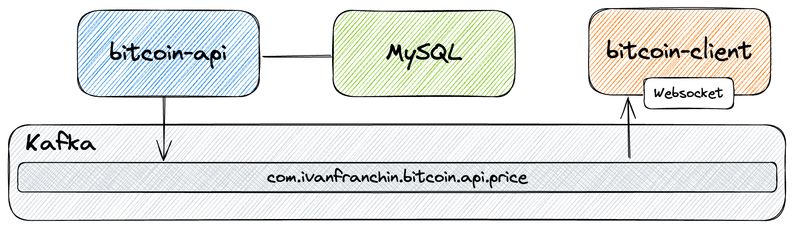
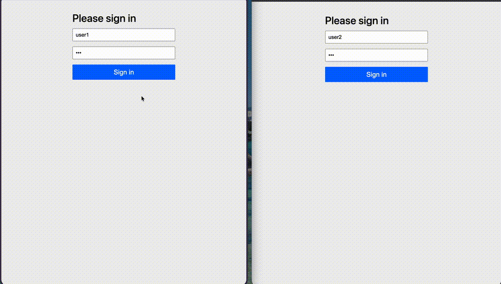

= springboot-kafka-websocket

The goal of this project is to implement two https://docs.spring.io/spring-boot/docs/current/reference/htmlsingle/[`String Boot`] applications, `bitcoin-api` and `bitcoin-client`. The first simulates `BTC` price changes and, the second, will listen from those changes and update a UI at real-time.

== Project Diagram

== Applications

* *bitcoin-api*
+
`Spring Boot` Web Java application service that simulates `BTC` price changes and pushes those changes to https://kafka.apache.org/[`Kafka`]

* *bitcoin-client*
+
`Spring Boot` Web Java application that was implemented using `Thymeleaf` as HTML template. It reads from `Kafka` and updates its UI using `Websocket`. It has also a chat where users can talk to each other, by sending comments publicly or privately.

== Prerequisites

* https://www.oracle.com/java/technologies/downloads/#java11[`Java 11+`]
* https://www.docker.com/[`Docker`]
* https://docs.docker.com/compose/install/[`Docker-Compose`]

== Start Environment

* Open a terminal and inside `springboot-kafka-websocket` root folder run
+
[source]
----
docker-compose up -d
----

* Wait for Docker containers to be with state `Up (healthy)`. To check it, run
+
[source]
----
docker-compose ps
----

== Running applications with Maven

Inside `springboot-kafka-websocket` root folder, run the following `Maven` commands in different terminals

* *bitcoin-api*
+
[source]
----
./mvnw clean spring-boot:run --projects bitcoin-api -Dspring-boot.run.jvmArguments="-Dserver.port=9081"
----

* *bitcoin-client*
+
[source]
----
./mvnw clean spring-boot:run --projects bitcoin-client -Dspring-boot.run.jvmArguments="-Dserver.port=9082"
----

== Running Applications as Docker containers

=== Build Application's Docker Image

* In a terminal, make sure you are in `springboot-kafka-websocket` root folder

* In order to build the application docker images, run the following script
+
[source]
----
./docker-build.sh
----

=== Application's Environment Variables

* *bitcoin-api*
+
|===
|Environment Variable | Description

|`MYSQL_HOST`
|Specify host of the `MySQL` database to use (default `localhost`)

|`MYSQL_PORT`
|Specify port of the `MySQL` database to use (default `3306`)

|`KAFKA_HOST`
|Specify host of the `Kafka` message broker to use (default `localhost`)

|`KAFKA_PORT`
|Specify port of the `Kafka` message broker to use (default `29092`)

|`ZIPKIN_HOST`
|Specify host of the `Zipkin` distributed tracing system to use (default `localhost`)

|`ZIPKIN_PORT`
|Specify port of the `Zipkin` distributed tracing system to use (default `9411`)
|===

* *bitcoin-client*
+
|===
|Environment Variable | Description

|`KAFKA_HOST`
|Specify host of the `Kafka` message broker to use (default `localhost`)

|`KAFKA_PORT`
|Specify port of the `Kafka` message broker to use (default `29092`)

|`ZIPKIN_HOST`
|Specify host of the `Zipkin` distributed tracing system to use (default `localhost`)

|`ZIPKIN_PORT`
|Specify port of the `Zipkin` distributed tracing system to use (default `9411`)
|===

== Run Application's Docker container

* In a terminal, make sure you are inside `springboot-kafka-websocket` root folder

* Run following script
+
[source]
----
./start-apps.sh
----

* Wait for application's Docker containers `STATUS` to be `Up (healthy)`. You can check by running
+
[source]
----
docker ps -f name=bitcoin-api -f name=bitcoin-client
----

== Applications URLs

|===
|Application |URL |Credentials (user/pass)

|bitcoin-api
|http://localhost:9081/swagger-ui.html
|

|bitcoin-client
|http://localhost:9082
|`user1/123` or `user2/123`
|===

The gif below shows two users checking real-time the `BTC` price changes. Besides, they are using a chat channel to
communicate with each other.

== Useful Links & Commands

* *Zipkin*
+
`Zipkin` can be accessed at http://localhost:9411

* *Kafka Topics UI*
+
`Kafka Topics UI` can be accessed at http://localhost:8085

* *Kafka Manager*
+
`Kafka Manager` can be accessed at http://localhost:9000
+
_Configuration_
+
- First, you must create a new cluster. Click on `Cluster` (dropdown button on the header) and then on `Add Cluster`
- Type the name of your cluster in `Cluster Name` field, for example: `MyCluster`
- Type `zookeeper:2181` in `Cluster Zookeeper Hosts` field
- Enable checkbox `Poll consumer information (Not recommended for large # of consumers if ZK is used for offsets tracking on older Kafka versions)`
- Click on `Save` button at the bottom of the page.

* *MySQL*
+
[source]
----
docker exec -it mysql mysql -uroot -psecret --database=bitcoindb
select * from prices;
----

== Shutdown

* To stop applications
** If they were started with `Maven`, go to the terminals where they are running and press `Ctrl+C`
** If they were started as Docker containers, go to a terminal and, inside `springboot-kafka-websocket` root folder, run the script below
+
[source]
----
./stop-apps.sh
----
* To stop and remove docker-compose containers, network and volumes, go to a terminal and, inside `springboot-kafka-websocket` root folder, run the following command
+
[source]
----
docker-compose down -v
----

== Cleanup

To remove the Docker images created by this project, go to a terminal and, inside `springboot-kafka-websocket` root folder, run the script below
[source]
----
./remove-docker-images.sh
----