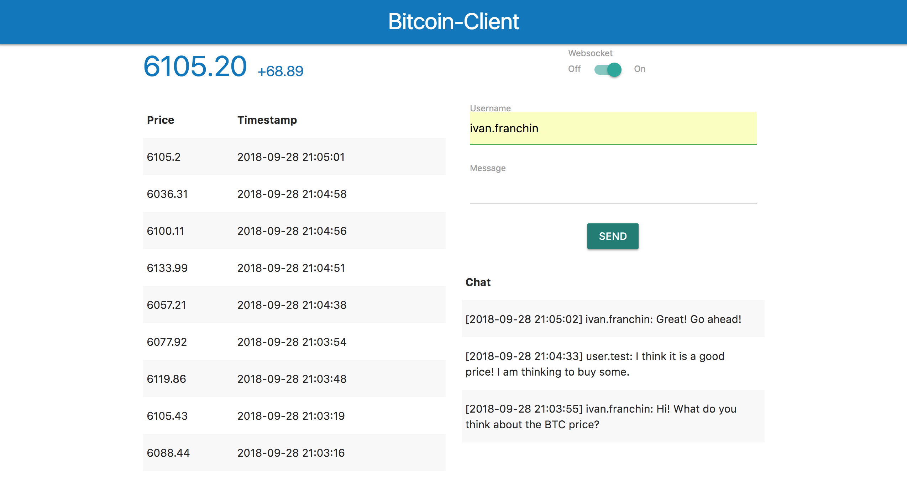

= springboot-kafka-websocket

== Goal

The goal of this project is to implement two micro-services: 1) bitcoin-api: responsible simulate the BTC price changes
and push those price changes to Kafka and 2) bitcoin-client: service that reads from Kafka and updates its UI using
Websockets.

== Start Environment

=== Docker Compose

- Open one terminal

- In `/springboot-kafka-websocket` root folder run
```
docker-compose up -d
```
[NOTE]
====
To stop and remove containers, networks, images, and volumes
```
docker-compose down -v
```
====

- Wait a little bit until all containers are Up (healthy). You can check their status running
```
docker-compose ps
```

== Start Services

=== eureka-server

- Open a new terminal
- Inside `/springboot-kafka-websocket/eureka-server` folder run
```
mvn spring-boot:run
```
- The link for eureka-server is http://localhost:8761

=== bitcoin-api

- Open a new terminal
- Inside `/springboot-kafka-websocket/bitcoin-api` folder run
```
mvn spring-boot:run
```
- The link for bitcoin-api swagger is http://localhost:8081/swagger-ui.html

=== bitcoin-client

- Open a new terminal
- Inside `/springboot-kafka-websocket/bitcoin-client` folder run
```
mvn spring-boot:run
```
- The link for bitcoin-client website is http://localhost:8082



== Useful links

- Zipkin can be accessed at http://localhost:9411

== TODO

- bitcoin-client: add limit to rows in the table