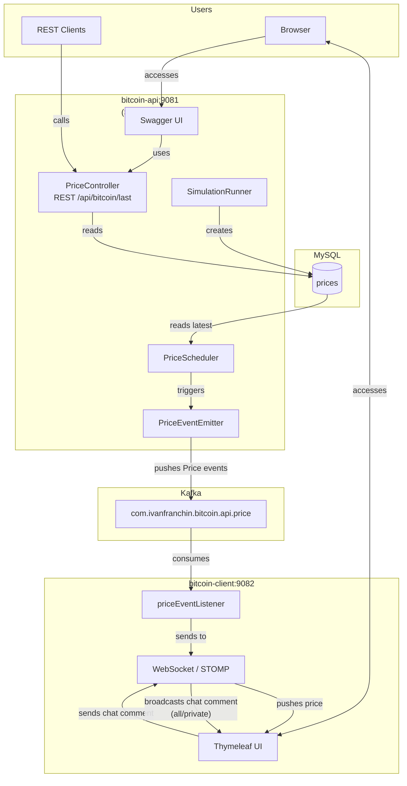
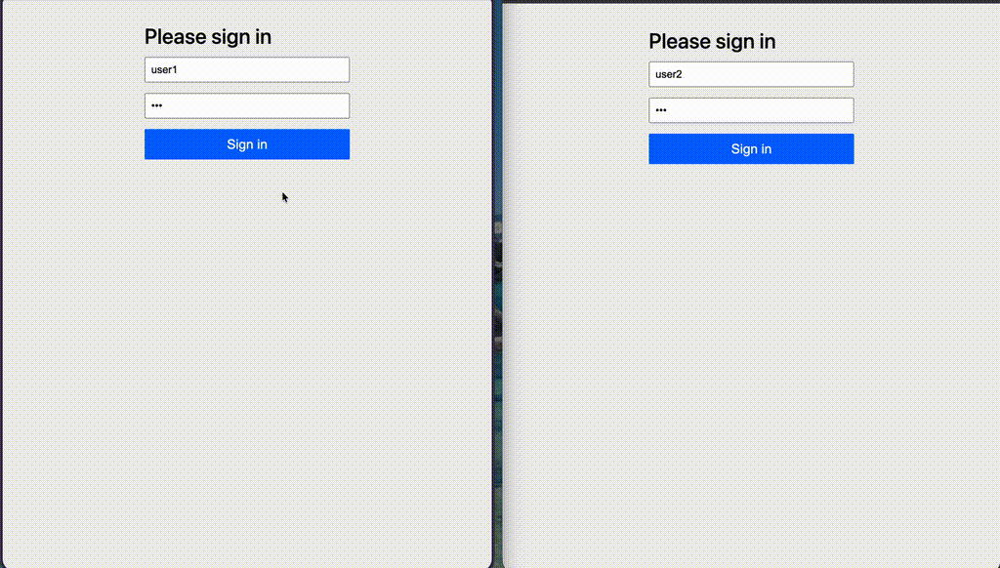

# springboot-kafka-websocket

[](LICENSE)
[](https://buymeacoffee.com/ivan.franchin)

The goal of this project is to implement two [`Spring Boot`](https://docs.spring.io/spring-boot/index.html) applications: `bitcoin-api` and `bitcoin-client`. The `bitcoin-api` application simulates `BTC` price changes, while the `bitcoin-client` application listens to these changes and updates a real-time UI. The `bitcoin-client` UI is secured using Basic Authentication.

## Proof-of-Concepts & Articles

On [ivangfr.github.io](https://ivangfr.github.io:), I have compiled my Proof-of-Concepts (PoCs) and articles. You can easily search for the technology you are interested in by using the filter. Who knows, perhaps I have already implemented a PoC or written an article about what you are looking for.

## Additional Readings

- [Medium]: [**Building a Web Chat with Social Login using Spring Boot: Introduction**](https://medium.com/@ivangfr/building-a-web-chat-with-social-login-using-spring-boot-introduction-644702e6be8e)
- [Medium]: [**News Producer and Consumer Tutorial**](https://medium.com/@ivangfr/list/news-producer-and-consumer-tutorial-815f134a1eda)

## Project Overview



## Applications

- **bitcoin-api**

  `Spring Boot` Web Java application service that simulates `BTC` price changes and pushes those changes to [`Kafka`](https://kafka.apache.org/)

- **bitcoin-client**

  `Spring Boot` Web Java application that was implemented using `Thymeleaf` as HTML template. It reads from `Kafka` and updates its UI using `Websocket`. It has also a chat where users can talk to each other by sending messages publicly or privately.

## Prerequisites

- [`Java 25`](https://www.oracle.com/java/technologies/downloads/#java25) or higher
- A containerization tool (e.g., [`Docker`](https://www.docker.com), [`Podman`](https://podman.io), etc.)

## Start Environment

- Open a terminal and inside the `springboot-kafka-websocket` root folder run:

  ```bash
  docker compose up -d
  ```

- Wait for Docker containers to be up and running. To check it, run:

  ```bash
  docker ps -a
  ```

## Running applications with Maven

Inside the `springboot-kafka-websocket` root folder, run the following `Maven` commands in different terminals:

- **bitcoin-api**

  ```bash
  ./mvnw clean spring-boot:run --projects bitcoin-api \
    -Dspring-boot.run.jvmArguments="-Dserver.port=9081"
  ```

- **bitcoin-client**

  ```bash
  ./mvnw clean spring-boot:run --projects bitcoin-client \
    -Dspring-boot.run.jvmArguments="-Dserver.port=9082"
  ```

## Running Applications as Docker containers

### Build Application's Docker Image

- In a terminal, make sure you are inside the `springboot-kafka-websocket` root folder.

- In order to build the application docker images, run the following script:

  ```bash
  ./build-docker-images.sh
  ```

### Application's Environment Variables

- **bitcoin-api**

  | Environment Variable | Description |
  |---------------------|-------------|
  | `MYSQL_HOST` | Specify host of the `MySQL` database to use (default `localhost`) |
  | `MYSQL_PORT` | Specify port of the `MySQL` database to use (default `3306`) |
  | `KAFKA_HOST` | Specify host of the `Kafka` message broker to use (default `localhost`) |
  | `KAFKA_PORT` | Specify port of the `Kafka` message broker to use (default `29092`) |

- **bitcoin-client**

   Environment Variable | Description |
  ---------------------|-------------|
   `KAFKA_HOST` | Specify host of the `Kafka` message broker to use (default `localhost`) |
   `KAFKA_PORT` | Specify port of the `Kafka` message broker to use (default `29092`) |

### Start Application's Docker container

- In a terminal, make sure you are inside the `springboot-kafka-websocket` root folder.

- Run the following script:

  ```bash
  ./start-apps.sh
  ```

## Applications URLs

| Application | URL | Credentials (user/pass) |
|------------|-----|------------------------|
| bitcoin-api | http://localhost:9081/swagger-ui.html | |
| bitcoin-client | http://localhost:9082 | `user1/123` or `user2/123` |

The gif below shows two users checking real-time the `BTC` price changes. Additionally, they are using a chat channel to communicate with each other.



## Useful Links & Commands

- **Kafdrop**

  `Kafdrop` can be accessed at http://localhost:9000

- **MySQL**

  ```bash
  docker exec -it -e MYSQL_PWD=secret mysql mysql -uroot --database bitcoindb
  select * from prices;
  ```

## Shutdown

- To stop applications

  - If they were started with `Maven`, go to the terminals where they are running and press `Ctrl+C`.

  - If they were started as Docker containers, go to a terminal and, inside the `springboot-kafka-websocket` root folder, run the script below:

    ```bash
    ./stop-apps.sh
    ```

- To stop and remove docker compose containers, network and volumes, go to a terminal and, inside the `springboot-kafka-websocket` root folder, run the following command:

  ```bash
  docker compose down -v
  ```

## Running Tests

The tests do **not** require a running environment — no MySQL or Kafka needed.

- **Run all tests (both modules)**

  ```bash
  ./mvnw clean test
  ```

- **Run tests for a single module**

  ```bash
  ./mvnw clean test --projects bitcoin-api
  ./mvnw clean test --projects bitcoin-client
  ```

- **Run a single test class**

  ```bash
  ./mvnw test --projects bitcoin-api -Dtest=PriceControllerTests
  ./mvnw test --projects bitcoin-client -Dtest=SecurityConfigTests
  ```

- **Run a single test method**

  ```bash
  ./mvnw test --projects bitcoin-api -Dtest=PriceControllerTests#testGetLastPriceReturnsLatestBitcoinPrice
  ```

## Code Formatting

Uses [Spotless Maven Plugin](https://github.com/diffplug/spotless/tree/main/plugin-maven) + [Google Java Format](https://github.com/google/google-java-format) (Java) and [Prettier](https://prettier.io/) (JS/HTML) for automated formatting.

- **Check formatting:**

  ```bash
  ./mvnw spotless:check
  ```

- **Auto-fix formatting:**

  ```bash
  ./mvnw spotless:apply
  ```

Formatting is enforced automatically during `./mvnw verify`.

## Cleanup

To remove the Docker images created by this project, go to a terminal and, inside the `springboot-kafka-websocket` root folder, run the script below:

```bash
./remove-docker-images.sh
```

## How to optimize the GIF in the documentation folder

- [Medium]: [**How I Reduce GIF and Screenshot Sizes for My Technical Articles on macOS**](https://medium.com/itnext/how-i-reduce-gif-and-screenshot-sizes-for-my-technical-articles-on-macos-7fea331afc68)

## Support

If you find this useful, consider buying me a coffee:

<a href="https://buymeacoffee.com/ivan.franchin"></a>

## License

This project is licensed under the [MIT License](./LICENSE).
